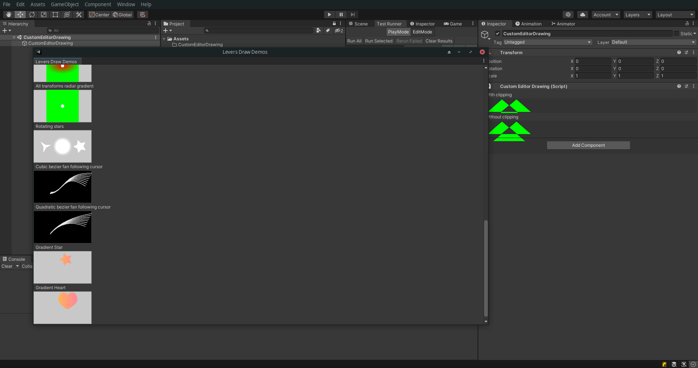
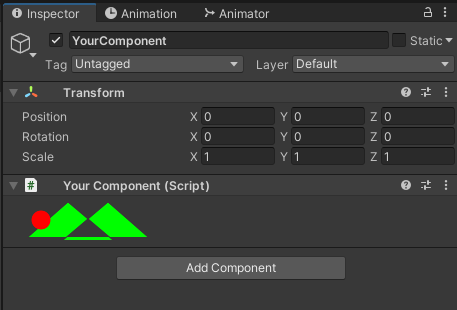

<a name="readme-top"></a>

<!-- PROJECT LOGO -->
<br />
<div align="center">
  <a href="https://github.com/errorStream/levers">
    
  </a>

<h3 align="center">Levers</h3>

  <p align="center">
    Drawing primitives for use in unity editor UIs.
    <br />
    <a href="https://github.com/errorStream/levers/wiki"><strong>Explore the docs »</strong></a>
    <br />
    <br />
    <a href="https://github.com/errorStream/levers/releases">Download</a>
    ·
    <a href="https://github.com/errorStream/levers/issues">Report Bug</a>
    ·
    <a href="https://github.com/errorStream/levers/issues">Request Feature</a>
  </p>
</div>


<!-- TABLE OF CONTENTS -->
<details>
  <summary>Table of Contents</summary>
  <ol>
    <li>
      <a href="#about-the-project">About The Project</a>
      <ul>
        <li><a href="#who-is-this-for">Who is this for?</a></li>
      </ul>
    </li>
    <li>
      <a href="#getting-started">Getting Started</a>
      <ul>
        <li><a href="#dependencies">Dependencies</a></li>
        <li><a href="#installation">Installation</a></li>
      </ul>
    </li>
    <li><a href="#usage">Usage</a></li>
    <li><a href="#roadmap">Roadmap</a></li>
    <li><a href="#contributing">Contributing</a></li>
    <li><a href="#license">License</a></li>
    <li><a href="#contact">Contact</a></li>
    <li><a href="#acknowledgments">Acknowledgments</a></li>
  </ol>
</details>


<!-- ABOUT THE PROJECT -->
## About The Project




Levers is a library of drawing primitives for use in Unity editor
scripts, in other words it's designed as a more flexible, featureful,
and API consistent version of Handles.

The library was designed to have an API in the vein of HTML5 canvas or
Skia. It provides a series of shape primitives which can be filled
and/or stroked. These primitives include things like circles, squares,
stars, Bezier curves, etc. It conforms to IMGui design where it is
redrawn during the UI repaint phase each update.

### Who is this for?

This library is targeted towards people who are developing unity assets which
need editor UIs for interacting with them which require greater
customization than that which the built-in libraries provide, or for people
developing such UIs for internal tools for their own projects.

<p align="right">(<a href="#readme-top">back to top</a>)</p>

<!-- GETTING STARTED -->
## Getting Started

To get started with this library install the package through the unity package manager.

### Dependencies

The only dependency is a compatible Unity editor.

### Installation

1. Clone this repo or download a tar ball of the package through releases
2. Open a Unity project you want to install the library into
3. Under Window in the top menu open Package Manager
4. Click the plus in the top left.
   - If you cloned the repo
     1. Click "Add Package From Disk"
     2. Navigate to the package.json file and select it
   - If you downloaded the package through releases
     3. Click "Add Package From Tarball"
     4. Navigate to the `.tgz` file and select it
   - If you want to install directly from a git url
     1. Click "Add Package from git URL"
     2. Paste in a git url. This is available from the Code dropdown
        in the top right. In this case it would be
        https://github.com/errorStream/Levers.git
     3. Click "Add"
5. (Optional) Open the Samples area and click "Import" by the samples to bring in some example code

<p align="right">(<a href="#readme-top">back to top</a>)</p>

<!-- USAGE EXAMPLES -->
## Usage

Levers can be used like any other unity editor UI library. This
example demonstrates a common approach where you reserve an area of
size 500x400 with GUI layout and draw a green shape inside it. Notice
that positions are specified in screen space, so you have to offset
each position to the start of the reserved Rect.

```csharp
using UnityEngine;
using UnityEditor;
using Levers;

[CustomEditor(typeof(YourComponent))]
public class YourComponentEditor : Editor
{
    public override void OnInspectorGUI()
    {
        // Reserve an area to draw in
        var position = GUILayoutUtility.GetRect(500, 40); 
        // Create a new path starting at the top left corner
        var path = new Path2D(new Vector2(position.x + 7, position.y + 37));
        // Add lines to the path to define an area to fill
        path.LineTo(new Vector2(position.x + 47, position.y + 2));
        path.LineTo(new Vector2(position.x + 112, position.y + 57));
        path.LineTo(new Vector2(position.x + 22, position.y + 57));
        path.LineTo(new Vector2(position.x + 87, position.y + 2));
        path.LineTo(new Vector2(position.x + 127, position.y + 37));
        // Fill the path with a green color
        Draw.Fill = Color.green;
        // Don't stroke the outline
        Draw.Stroke = Color.clear;
        // Draw the path
        Draw.Path(path);
    }
}
```

Levers supports `GUI.matrix`, which means to save typing we can offset
all draws positions by the top left corner of the reserved block.

```csharp
using UnityEngine;
using UnityEditor;
using Levers;

[CustomEditor(typeof(YourComponent))]
public class YourComponentEditor : Editor
{
    public override void OnInspectorGUI()
    {
        var position = GUILayoutUtility.GetRect(500, 40);
        // Store the original matrix
        var originalMatrix = GUI.matrix;
        // Add transformation to the matrix to move the path to the top left corner of the rect
        GUI.matrix = Matrix4x4.Translate(position.min) * originalMatrix;
        var path = new Path2D(new Vector2(7, 37));
        path.LineTo(new Vector2(47, 2));
        path.LineTo(new Vector2(112, 57));
        path.LineTo(new Vector2(22, 57));
        path.LineTo(new Vector2(87, 2));
        path.LineTo(new Vector2(127, 37));
        Draw.Fill = Color.green;
        Draw.Stroke = Color.clear;
        Draw.Path(path);
        // Restore the original matrix
        GUI.matrix = originalMatrix;
    }
}
```

An even easier way is to use `GUI.BeginGroup`, which modifies
`GUI.matrix` and makes a clipping area to prevent your code from
drawing outside the reserved block.

```csharp
using UnityEngine;
using UnityEditor;
using Levers;

[CustomEditor(typeof(YourComponent))]
public class YourComponentEditor : Editor
{
    public override void OnInspectorGUI()
    {
        // Define group in the reserved space
        GUI.BeginGroup(GUILayoutUtility.GetRect(500, 40));
        var path = new Path2D(new Vector2(7, 37));
        path.LineTo(new Vector2(47, 2));
        path.LineTo(new Vector2(112, 57));
        path.LineTo(new Vector2(22, 57));
        path.LineTo(new Vector2(87, 2));
        path.LineTo(new Vector2(127, 37));
        Draw.Fill = Color.green;
        Draw.Stroke = Color.clear;
        Draw.Path(path);
        // End group
        GUI.EndGroup();
    }
}
```

Drawing settings are defined by modifying static properties of the
draw class. If you want to break up your drawing code into functions,
you probably want to return the draw settings to a default state
temporarily. This can be done with `Draw.PushState()` and
`Draw.PopState()`, which puts a new settings frame on the stack with
default settings and which can be modified through the `Draw` class
properties, this can then be popped to restore the original
properties.

```csharp
using UnityEngine;
using UnityEditor;
using Levers;

[CustomEditor(typeof(YourComponent))]
public class YourComponentEditor : Editor
{
    private static void DrawRedDot()
    {
        // Push draw settings state frame with default settings
        Draw.PushState();
        // Set fill color of current draw settings state frame
        Draw.Fill = Color.red;
        Draw.Circle(20, 20, 20);
        // Restore draw settings state from before the PushState call
        Draw.PopState();
    }
    
    public override void OnInspectorGUI()
    {
        GUI.BeginGroup(GUILayoutUtility.GetRect(500, 40));
        var path = new Path2D(new Vector2(7, 37));
        path.LineTo(new Vector2(47, 2));
        path.LineTo(new Vector2(112, 57));
        path.LineTo(new Vector2(22, 57));
        path.LineTo(new Vector2(87, 2));
        path.LineTo(new Vector2(127, 37));
        Draw.Fill = Color.green;
        Draw.Stroke = Color.clear;
        Draw.Path(path);
        DrawRedDot();
        GUI.EndGroup();
    }
}
```



_For more examples, see the Samples in the unity package or the `Samples~` directory of this repository_

<p align="right">(<a href="#readme-top">back to top</a>)</p>


<!-- ROADMAP -->
## Roadmap

- [x] Basic shapes
- [x] Clipping Rect
- [x] Matrix support
- [x] Texture fill
- [x] Fill rules
- [x] Path2D
- [x] Simple anti-aliasing
- [ ] More drawing options
  - [ ] More stroke joins
  - [ ] Texture stroke fill
  - [ ] Multi-sample anti aliasing
  - [ ] Multiple sub-paths in a single path
  - [ ] More shape primitives
  - [ ] Data visualization helpers
  - [ ] Event handling
  - [ ] Partial overriding states
- [ ] Find and fix edge cases
- [ ] Test on more Unity versions

See the [open issues](https://github.com/errorStream/levers/issues)
for a full list of proposed features (and known issues).

<p align="right">(<a href="#readme-top">back to top</a>)</p>


<!-- CONTRIBUTING -->
## Contributing

If you have a suggestion that would make this better, please fork the
repo and create a pull request. You can also simply open an issue with
the tag "enhancement".

Don't forget to give the project a star! Thanks again!

1. Fork the Project
2. Create your Feature Branch (`git checkout -b feature/AmazingFeature`)
3. Commit your Changes (`git commit -m 'Add some AmazingFeature'`)
4. Push to the Branch (`git push origin feature/AmazingFeature`)
5. Open a Pull Request

<p align="right">(<a href="#readme-top">back to top</a>)</p>


<!-- LICENSE -->
## License

Distributed under the MIT License. See `LICENSE.txt` for more information.

<p align="right">(<a href="#readme-top">back to top</a>)</p>


<!-- CONTACT -->
## Contact

ErrorStream - [itch.io profile](https://errorstream.itch.io) - errorstream@amequus.com

Project Link: [https://github.com/errorStream/levers](https://github.com/errorStream/levers)

<p align="right">(<a href="#readme-top">back to top</a>)</p>


<!-- ACKNOWLEDGMENTS -->
## Acknowledgments

* [Going deep with IMGUI and Editor customization | Unity
  Blog](https://blog.unity.com/engine-platform/imgui-and-editor-customization) :
  The best introduction to Unitys IMGui system that I have found. I
  recommend you read this to understand the design philosophy of the
  core IMGui system which I designed this library in consideration of.

<p align="right">(<a href="#readme-top">back to top</a>)</p>


<!-- MARKDOWN LINKS & IMAGES -->
<!-- https://www.markdownguide.org/basic-syntax/#reference-style-links -->
[product-screenshot]: images/screenshot.png
